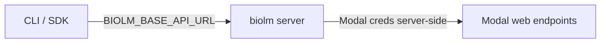

# OSS Modal Integration Contract

This document defines what the **Modal OSS deployment repo** must implement so
`biolm server` can discover deployments and proxy the CLI/SDK to them.

## Overview



- **Client → server**: `BIOLM_BASE_API_URL` (e.g. `http://127.0.0.1:8787/api/v3`)
- **Server → Modal**: `MODAL_TOKEN_ID`, `MODAL_TOKEN_SECRET` (never sent to clients)
- **Platform auth** (OAuth, hosted tokens) stays on `biolm.ai` — not proxied

## Deploy naming conventions

`biolm server` scans the configured Modal environment (``BIOLM_SERVER_MODAL_ENV``,
default ``main``) for deployed apps.

| Convention | Value | Example |
|------------|-------|---------|
| App name (production) | `{slug}` | `esm2-8m` |
| App name prefix (OSS) | `biolm-{slug}` | `biolm-esm2-8m` |
| Shared gateway app | `biolm-gateway` | routes all models via one web endpoint |
| Label (optional OSS) | `biolm.model={slug}` | `biolm.model=esm2-8m` |
| Version label (optional) | `biolm.version={semver}` | `biolm.version=1.0.0` |

The scanner resolves each deployment to a **v3 API base URL** (including `/api/v3` if applicable).

## Required API surface on each Modal deployment

Each deployed model must expose BioLM v3-compatible routes:

### Inference

```
POST /api/v3/{model}/{action}/
Content-Type: application/json

{
  "items": [{"sequence": "ACDEFGHIKLMNPQRSTVWY"}],
  "params": {}
}
```

Response:

```json
{
  "results": [...]
}
```

Supported actions depend on the model (`encode`, `predict`, `generate`, `lookup`, etc.).

### Schema

```
GET /api/v3/schema/{model}/{action}/
```

Returns JSON Schema used by the SDK for batch sizing and validation. Should include
`properties.items.maxItems` when batching applies.

### Health / liveness

Either:

- `GET /api/v3/schema/{model}/{action}/` returns 200, or
- `GET /_health` returns 200

## What `biolm server` exposes to clients

| Method | Path | Behavior |
|--------|------|----------|
| GET | `/health` | Server + registry summary |
| GET | `/api/ui/community-api-models/` | **Deployed models only** (registry ∩ catalog) |
| GET | `/api/ui/community-api-models/{slug}/` | Model detail for deployed slug |
| GET | `/api/v3/schema/{model}/{action}/` | Proxy to Modal deployment |
| POST | `/api/v3/{model}/{action}/` | Proxy to Modal deployment |
| GET | `/api/v3/catalog/` | Full OSS catalog (all deployable models) |
| * | `/api/v3/protocols/*`, `/api/auth/*`, `/o/*` | **501** — use hosted platform |

## Catalog metadata

Bundled catalog entries (see `biolm/server/data/catalog.json`) use:

```json
{
  "model_slug": "esm2-8m",
  "model_name": "ESM2 8M",
  "encoder": true,
  "predictor": false,
  "generator": false,
  "actions": ["encode"],
  "description": "..."
}
```

The OSS repo should eventually own the full catalog artifact; `biolm server` merges
catalog metadata with live registry entries for `community-api-models` responses.

## Server-side configuration (fallback)

Until Modal introspection is fully wired, users can configure deployments explicitly:

### Environment

```bash
export BIOLM_SERVER_MODELS=esm2-8m,esmfold
```

### YAML (`~/.biolm/server.yaml`)

```yaml
models:
  - slug: esm2-8m
    url: https://your-workspace--biolm-esm2-8m.modal.run/api/v3
    actions: [encode]
  - slug: esmfold
    url: https://your-workspace--biolm-esmfold.modal.run/api/v3
    actions: [predict]
```

## Server auth (client → server)

| Mode | Config |
|------|--------|
| None (default on localhost) | `BIOLM_SERVER_AUTH=none` |
| Token | `BIOLM_SERVER_AUTH=token` + `BIOLM_SERVER_TOKEN=...` |

Client sends: `Authorization: Token {BIOLM_SERVER_TOKEN}`

## Open questions for OSS repo author

1. Exact Modal web endpoint URL pattern after deploy (custom domain vs `*.modal.run`)
2. Whether schema routes live on the same app or a shared gateway
3. Canonical catalog generation at deploy time vs static repo file
4. One **golden path** reference: `esm2-8m` + `encode` end-to-end (deploy, schema, infer)
5. Modal API calls for listing deployed apps by label (for scanner implementation)

Production BioLM uses Modal environment ``main`` with per-model apps (``esm2-8m``,
``esmfold``, …) and a shared ``biolm-gateway`` web endpoint that routes
``/api/v3/{model}/{action}`` to backends. Set ``BIOLM_SERVER_MODAL_ENV=main`` when
scanning production.

Only apps whose slug appears in the **official BioLM catalog** on ``biolm.ai``
(``/api/ui/community-api-models/``) are registered. JSON schemas are always fetched
from the platform (``biolm.ai/api/v3/schema/...``), not from Modal deployments.

## Example client setup

```bash
pip install biolm[server]
export MODAL_TOKEN_ID=...
export MODAL_TOKEN_SECRET=...
biolm server start

# separate terminal — hybrid: login on platform, models on proxy
export BIOLM_BASE_API_URL=http://127.0.0.1:8787/api/v3
biolm login
biolm model list
biolm model run esm2-8m encode -i seq.json
```
